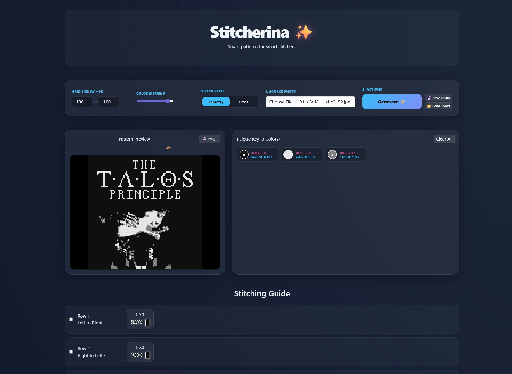
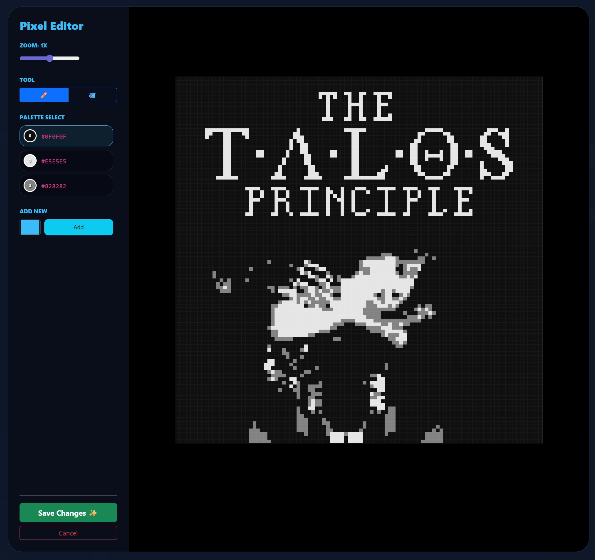

# Stitcherina ✨

**Stitcherina** is your cozy digital companion for turning photos and pixel art into beautiful, easy-to-follow stitching patterns. Whether you are working on a large tapestry or a delicate cross-stitch, Stitcherina helps you organize your threads and keep your place without the mess of paper and highlighters.

---

### Why you'll love Stitcherina:

*   **Interactive Pixel Editor ✏️**
    Found a pixel that doesn't look right? Click the preview to open the built-in editor! Use the **Pencil** tool to paint individual stitches or the **Bucket** tool to recolor every instance of a thread color globally.

*   **Precision Zoom 🔍**
    Get up close and personal with your design. Our new zoom system lets you scale your canvas from **0.1x all the way to 8x**, ensuring you never miss a single detail.

*   **Magic Pixelation ✨**
    Upload any photo and watch it transform into a perfect grid. If you upload existing pixel art, we’ll keep it crisp and preserve the original quality without any distortion.
    
*   **Smart Palette & Color Merging 🎨**
    Too many shades of red? Use the **Color Merge** slider to gently simplify your thread list. After editing, Stitcherina automatically cleans up your palette, removing any unused colors.

*   **Two Ways to Stitch 🧶**
    *   **Tapestry Mode:** Perfect for those who weave back and forth (Left-to-Right then Right-to-Left).
    *   **Cross-Stitch Mode:** For a classic, consistent Left-to-Right journey.

*   **Never Lose Your Spot 📍**
    Click on individual color blocks to mark them as "stitched," or check off entire rows. Row progress is automatically tracked as you click!

*   **Save & Resume 💾**
    Export your entire project (including progress and edits) as a tiny `.json` file, or save a high-quality **PNG image** of your pattern to share or print.

---

### How to use:

1.  **Set your grid size:** Choose your desired width and height.
2.  **Upload your photo:** Pick a photo or a previous Stitcherina save file.
3.  **Refine your art:** Click the preview to paint or fill colors until it’s perfect.
4.  **Generate:** Hit the button and let the magic happen!
5.  **Stitch away:** Mark blocks as you go to stay organized.

---

### Privacy Note 🔒
Stitcherina is a **WebAssembly** app, which means your photos and project data never leave your computer. All the processing happens right inside your browser!

*Happy stitching! May your tension be perfect and your threads never knot.* 🧶✨